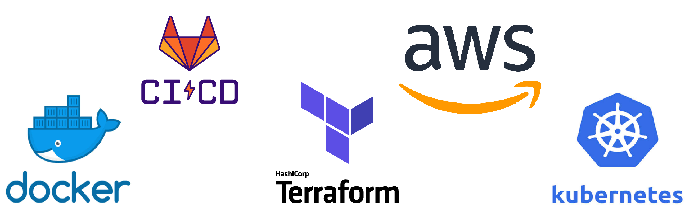
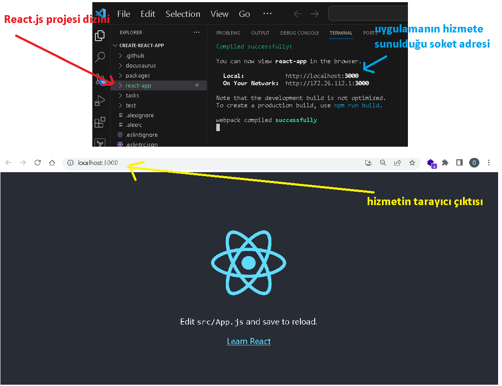
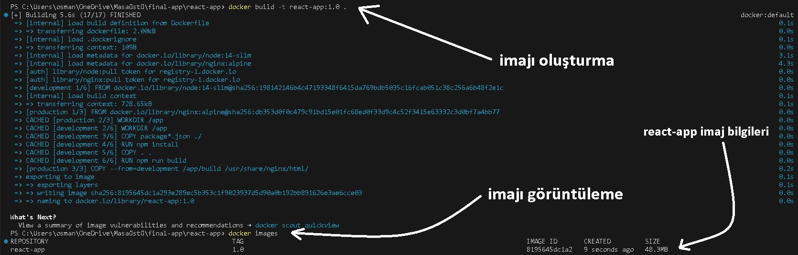
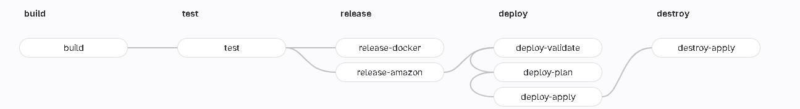
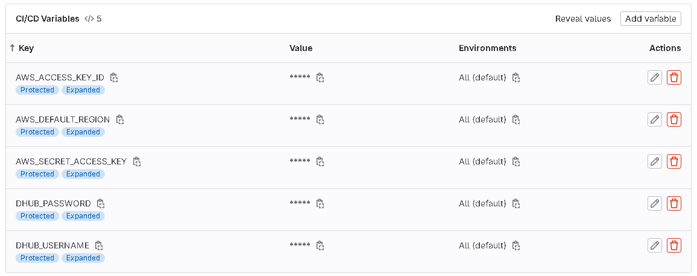
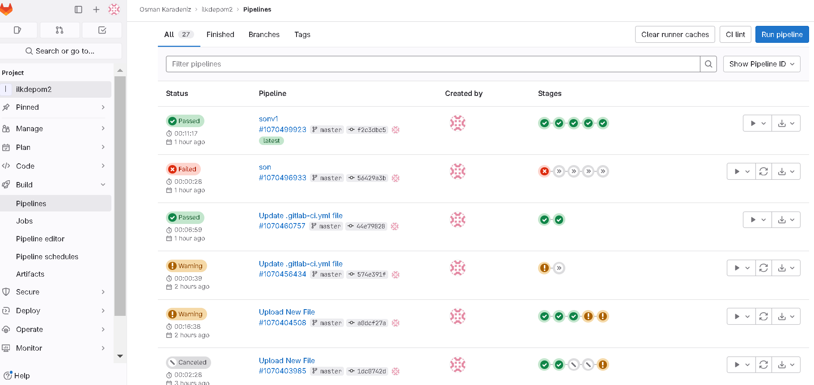
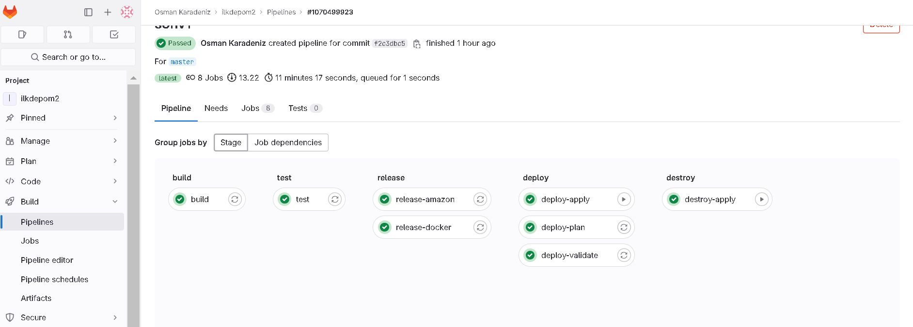
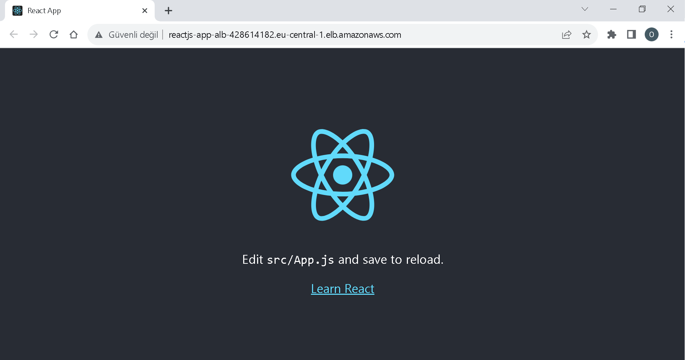

# Logo Yazılım & Fırat Üniversitesi LOG-in Bitirme Projesi
Bu proje bir React uygulamasının DevOps kültürü ile hayata geçirme sürecini kapsamaktadır.


# İçindekiler

1. [Proje Hakkında](#proje-hakkında)
2. [React.js uygulamasını oluşturma](#reactjs-uygulamasını-oluşturma)
3. [Docker ile imaj oluşturma](#docker-ile-imaj-oluşturma)
4. [Gitlab CI/CD ile işlem hattı tasarlama ve geliştirme](#gitlab-cicd-ile-işlem-hattı-tasarlama-ve-geliştirme)
5. [Terraform altyapı sağlayıcısı eşliğinde AWS hizmetlerine Dağıtım gerçekleştirmesi](./terraform)
6. [Kubernetes ortamında uygulamanın dağıtılması](./kubernetes)
</br>


# Proje Hakkında
Bitirme projesi dökümanında bulunan yönergeleri takip ederek başlangıç aşamasında React uygulaması oluşturma aracı [Create React App](https://github.com/facebook/create-react-app) kullanarak projeyi oluşturdum.
Oluşturduğum bu projeyi dockerize etmek üzere bir imaj oluşturmak için `Dockerfile` dosyasını hazırladım ayrıca oluşacak konteyner içerisinde olmaması gereken dosyaları hariç tutmak için `.dockerignore` dosyasını ekledim ve bu şekilde imajı olabilecek en minimal boyuta indirgemeye çalıştım. Gitlab CI/CD aracını kullanarak bir işlem hattı tasarladım ve Terraform altyapı sağlayıcısı eşliğinde AWS hizmetleri üzerinde ve ayrıca Kubernetes ortamında uygulamayı hayata geçirdim.
<br/>
#### Kullanılan Teknolojiler : 



<br/>
<br/>
<br/>
<br/>
<br/>

# React.js uygulamasını oluşturma
Döküman içeriğinde bulunan [Create React App](https://github.com/facebook/create-react-app) aracının dökümanını baz alarak ilerledim. Öncelikle ilgili depo içeriğini GitHub üzerinden yerel ortamıma git aracılığı ile şu komutu koşturarak çektim ;
``` 
git clone https://github.com/facebook/create-react-app.git
 ```

Daha sonra yerel ortamıma çektiğim içeriği barındıran dizine geçiş yaparak terminal içerisinde "react-app" isimli projeyi oluşturmak için şu komutu koşturdum ;
``` 
npx create-react-app "react-app"
``` 

Ekranıma oluşturulma sürecindeki izler yansıdı ;

```
PS C:\Users\osman\OneDrive\Masaüstü\create-react-app> npx create-react-app "react-app"

Creating a new React app in C:\Users\osman\OneDrive\Masaüstü\create-react-app\react-app.

Installing packages. This might take a couple of minutes.
Installing react, react-dom, and react-scripts with cra-template...
....
..
.
Happy hacking!
```

Kontrol ettiğimde dizinde "react-app" isimli bir klasör oluştu ve içerisinde React.js projemin uygulama dosyalarını ve bağımlılıklarını içeriyordu.
Daha sonra uygulamayı ayağa kaldırıp bir problem olup olmadığını kontrol etmek istedim ve bunun için React.js "react-app" uygulamasının dizinine geçiş yaparak
```
 npm start
```
Komutunu koşturdum uygulama sorunsuz bir şekilde ayağa kalktı terminal ve tarayıcımın çıktıları şu şekilde oldu ;


<br/>
<br/>
<br/>
<br/>


# Docker ile imaj oluşturma
- **Docker ortam sağlayıcısı** olarak süreci `Docker Desktop` uygulaması ile yürüttüm  
  - Docker Desktop , Windows ve Mac'te kapsayıcıları oluşturmaya ve çalıştırmaya başlamanızı, docker uygulamarını hızla derlemenizi, test etmenizi ve dağıtmanızı sağlayan bir yazılım platformudur.
    
- **Docker imajı nedir ?**
  - Uygulamanızın çalıştırılabilir bir sürümünün ve uygulamanın çalıştırılması için gereken tüm bağımlılıkların bir örneğini içeren bir şablondur.İmajlar, "Dockerfile" adı verilen özel bir betik kullanılarak oluşturulur ve imaj deposunda paylaşılabilirler. 
- **Docker görüntüsü nedir ?,**
  - Bir Docker imajının çalışan bir örneğini ifade eder. Yani Docker imajı bir şablondur ve Docker görüntüsü bu şablonun bir örneğidir. 


Yönergeler imajın boyutunu en düşük olacak şekilde hazırlamamızı istiyor bu nedenle oluşturduğum `Dockerfile` dosyasını **"Bir aşamadan miras alma"** yöntemi ile oluşturdum.

Temel imaj olarak ilk aşama için `node` imajlarından en düşük boyuta sahip olan `node-slim` kullandım. İkinci aşama için çok hafif olan `alpine` altyapısı ve yüksek performansı ile bilinen `nginx` web sunucusunun `nginx:alpine` imajını kullandım.

- Docker çok aşamalı yapısı (Bir aşamadan miras alma) :
  - Docker çok aşamalı yapısı, belirli görevleri gerçekleştirmek için bir görüntü ile başlar ve `AS stagename` komutu ile bu görüntüyü etiketleyerek aşama tamamlandıktan sonra `--from=stagename` komutu ile başlatılan yeni bir görüntü içerisine yalnızca bu aşama için gerekli dosyaları ve bağımlılıkları içerir bu sayede daha küçük ve daha optimize edilmiş Docker görüntüleri elde edebiliriz.

Oluşturmuş olduğum bu [Docker dosyası](./react-app/Dockerfile) iki aşama içermektedir : `development` adı verilen ilk aşama, bağımlılıkları yükler ve uygulamayı oluşturur; `production` adı verilen ikinci aşama ise uygulamayı çalıştırır.

- Docker imajını oluşturmak ve görüntülemek için komut kümesi ;
  - ```
    > docker build -t react-app:1.0 .
    > docker images
    ```
  - 

Docker imajını oluşturduktan sonra imajı test etmek üzere şu aşamaları yürüttüm.
1. **İmajı çalıştırma**
  - ```
     docker run -d -p 3000:80 react-app:1.0 
    ```
    - Bu komut içerisindeki "-p" parametresi "port" bilgisini ifade eder ve "3000" portuna gelen isteklerin "80" portuna yönlendirilmesini sağlamak amacı ile bu şekilde tanımlanmaktadır. İmaj içerisinde "80" portunu açmış olmam nedeni ile bu porta istekleri yönlendirmekteyim.
    - "-d" (detach) parametresi , Docker konteynerini arka planda çalıştırmak için kullanılır.

- Çalışma zamanında konteyneri izlemek için (-d) parametresi olmadan şu komut ile imajı çalıştırıyorum ;
  - ```
     docker run -p 3000:80 react-app:1.0 
    ```   
  - nginx web sunucusunun izleri terminal ekranıma yansımaya başladı.
Tarayıcı aracılığı ile hizmete erişmek için "127.0.0.1:3000" adresine erişmeye çalıştım ve izler içerisinde "GET" isteği oluştu paralelinde tarayıcıma React.js uygulamamın arayüzü yansıdı.

```
PS C:\Users\osman\OneDrive\Masaüstü\PATİKA\hafta 6> docker run -p 3000:80 react-app:1.0 
/docker-entrypoint.sh: /docker-entrypoint.d/ is not empty, will attempt to perform configuration
...
..
2023/11/04 18:33:25 [notice] 1#1: nginx/1.25.3
2023/11/04 18:33:25 [notice] 1#1: built by gcc 12.2.1 20220924 (Alpine 12.2.1_git20220924-r10)
2023/11/04 18:33:25 [notice] 1#1: OS: Linux 5.10.16.3-microsoft-standard-WSL2
...
..
172.17.0.1 - - [04/Nov/2023:18:33:30 +0000] "GET / HTTP/1.1" 200 644 "-" "Mozilla/5.0 (Windows NT 10.0; Win64; x64) AppleWebKit/537.36 (KHTML, like Gecko) Chrome/118.0.0.0 Safari/537.36" "-"
...
..
.
```
Bu şekilde imajımı kontrol etmiş ve konteyner yapısının çalıştığını test etmiş oldum.

2. **Çalışan konteynerları inceleme**
   - Docker içerisinde bulunan tüm konteynerları listelemek için şu komut kullanılır ;
     - `docker ps --all`
   - Ben sadece çalıştırmış olduğum "react-app:1.0" isimli ve versiyonlu konteynerı görmek istediğim için şu komutu koşturuyorum ;
     - `docker ps --filter "ancestor=react-app:1.0"`
     - Çıktı ;
   ```
     CONTAINER ID   IMAGE           COMMAND                  CREATED          STATUS          PORTS                  NAMES
     36fbed07ea40   react-app:1.0   "/docker-entrypoint.…"   48 seconds ago   Up 47 seconds   0.0.0.0:3000->80/tcp   quizzical_shtern
   ```
       
3. **Konteyner detaylarını görüntüleme ve içine girme**
  - Çalışan "36fbed07ea40" ıd bilgisine sahip konteynerın detaylarını görüntülemek için ;
    - `docker inspect 36fbed07ea40` bu komut bize konteynerın bütün detaylarını vermektedir.
```
[
    {
        "Id": "36fbed07ea407b31477f71c6f28fa8a2c1f20e4e481a2492504d36383a531c5c",
        "Created": "2023-11-09T19:08:37.0827641Z",
        "Path": "/docker-entrypoint.sh",
        "Args": [
            "nginx",
            "-g",
            "daemon off;"
        ],
        "State": {
            "Status": "running",
            "Running": true,
            "Paused": false,
       ...
       .
        "Ports": {
                "80/tcp": [
                    {
                        "HostIp": "0.0.0.0",
                        "HostPort": "3000"
                    }
                ]
            },
      ...
      .
```
- "36fbed07ea40" ID bilgisine sahip Konteyner içerisine girmek ve bir kabuk(shell) çalıştırmak için şu komutu çalıştırdım.
  - `docker exec -it 36fbed07ea40 /bin/sh`
    - -it ( interaktif mod ile bir bağlantı kurmak istediğimi belirten parametre)
    - Çıktı :
 ```
/ # ls
app                   dev                   docker-entrypoint.sh  home                  media                 opt                   root                  sbin                  sys                   usr
bin                   docker-entrypoint.d   etc                   lib                   mnt                   proc                  run                   srv                   tmp                   var
/ # cd var
/var # ls
cache  empty  lib    local  lock   log    mail   opt    run    spool  tmp
/var # cd log
/var/log # ls
nginx      
/var/log # cd nginx
/var/log/nginx # ls
access.log  error.log
/var/log/nginx # nginx -v
nginx version: nginx/1.25.3
 ```
<br/>
<br/>
<br/>
<br/>
<br/>

# Gitlab CI/CD ile işlem hattı tasarlama ve geliştirme
Dökümanda bulunan yönergelere göre bu aşamada `Dockerfile` dosyası dahil olacak şekilde bir işlem hattı tasarımı ve geliştirmesi sürecini gerçekleştirdim.


<details>
  <summary>Sürekli Entegrasyon (CI) nedir ?</summary>
  <p>

  CI, yazılım geliştirme sürecinin bir parçasıdır ve genellikle şu adımları içerir:
  
  - **Versiyon Kontrol Sistemine Entegrasyon:**
    Geliştiriciler, kodlarını bir versiyon kontrol sistemine (örneğin Git) yükler.
  
  - **Otomatik Derleme ve Test:**
    Yeni kod, CI sürecinde otomatik olarak derlenir ve test edilir. Derleme ve test işlemleri, her yeni kod değişikliği yapıldığında tetiklenir.
  
  - **Hata Tespiti:**
    Otomatik testler hataları tespit eder ve geliştiricilere geri bildirimde bulunur. Bu aşama, hataların daha erken tespit edilmesini ve düzeltilmesini sağlar.
  
  - **Tekrarlanabilirlik:**
    CI, kodun her zaman aynı şekilde derlenmesini ve test edilmesini sağlar. Bu, kodun farklı ortamlarda tutarlı bir şekilde çalışmasını sağlar.
  
  - **Otomatik Raporlama:**
    CI süreci genellikle derleme ve test sonuçlarıyla ilgili raporlar oluşturur.

  Sürekli entegrasyonun temel amacı, geliştiricilerin kodlarını sık sık entegre etmelerini ve olası hataları erken aşamada tespit ederek yazılım kalitesini artırmalarını sağlamaktır.

  </p>
</details>


<details>
  <summary>Sürekli Dağıtım (CD) nedir ?</summary>
  <p>

  Sürekli Dağıtım, yazılımın otomatik olarak bir ortamdan diğerine taşınmasını ifade eder. CD, genellikle şu iki kısma ayrılır:

  - **Sürekli Dağıtım (Continuous Deployment):**
    Başarıyla tamamlanan CI süreçlerinden geçen her kod değişikliği, otomatik olarak canlı üretim ortamına dağıtılır. Bu, yazılımın hızlı ve güvenilir bir şekilde kullanıcılara sunulmasını sağlar.
  
  - **Sürekli Dağıtım (Continuous Delivery):**
    Başarıyla tamamlanan CI süreçlerinden geçen her kod değişikliği, bir üretim ortamına otomatik olarak taşınır, ancak bu ortamda manuel bir onay süreci vardır. Yazılımın dağıtımı için manuel bir kontrol sağlar.

  Sürekli Dağıtım, yazılımın kullanıma sunulma sürecini hızlandırır, hataları en aza indirir ve müşterilere daha hızlı değer sağlamayı mümkün kılar.

  </p>
</details>


<details>
  <summary>GitLab İşlem Hattı (Pipeline) nedir ?</summary>

  İşlem Hattı, yazılım geliştirme sürecindeki adımları belirleyen ve bu adımları otomatikleştirerek yazılım projelerini daha verimli hale getiren bir araçtır. Yazılımın derlenmesi, test edilmesi ve dağıtılması gibi kritik süreçleri yönetir, bu da geliştiricilere hataları daha erken aşamalarda tespit etme ve düzeltme şansı tanır.

  - <strong>GitLab İşlem Hattı (Pipeline) temel öğeleri şunlardır:</strong>
    - <strong>Aşama (Stage):</strong>
      İşlem hattının belirli bir noktasında gerçekleşen bir dizi işlemi temsil eder. Genellikle yazılım geliştirme sürecinin belirli bir aşamasını temsil eder, örneğin derleme, test veya dağıtım aşamaları.
    - <strong>Görev (Job):</strong>
      İşlem hattı içindeki belirli bir adımı temsil eder. Her görev, belirli bir işlevi gerçekleştirmek için bir dizi komut içerebilir.
    - <strong>Çalıştırıcı (Runner):</strong>
      Görevleri gerçekleştirmekten sorumlu olan bilgisayar kaynaklarıdır. Çalıştırıcılar, İşlem hattının belirli bir aşamasındaki görevleri alır ve gerçekleştirir.

      - <strong>Çalıştırıcı (Runner) Türleri:</strong>
        - <strong>Paylaşılan (Shared) Çalıştırıcılar:</strong>
          GitLab Çalıştırıcıları, genel olarak birçok proje tarafından kullanılabilen ve farklı projelerden gelen talepleri karşılamak üzere tasarlanmış bir çalıştırıcı türüdür. Çeşitli projeler tarafından paylaşılarak geniş bir kullanım alanına sahiptir ve genellikle GitLab'ın ana sunucularında işlev görür.
        - <strong>Belirli (Specific) Çalıştırıcılar:</strong>
          - <strong>Projeye Özel Çalıştırıcılar:</strong>
            Belirli bir projeye özgü olarak yapılandırılan ve sadece bu projede çalışan çalıştırıcılardır.
          - <strong>Grup Çalıştırıcılar:</strong>
            Bir projeden ziyade, bir proje grubuna atanmış çalıştırıcılardır.
          - <strong>Ortak Çalıştırıcılar:</strong>
            GitLab CI/CD'nin tüm örneklerine (instances) hizmet veren ve tüm projelerde kullanılabilen çalıştırıcılardır.
</details>


### **İşlem hattı tasarımı ve geliştirilmesi**
Bu noktada dikkat ettiğim döküman içerisindeki yönergeler bu aşamada `En uygun DevOps standartlarını uygulayın ve takip edin` şeklinde bir yönlendirmede bulunmaktadır.
Bu aşamadan sonra ise sürecin AWS Hizmetleri üzerinde dağıtmamızı ve bunu terraform altyapı sağlayıcısı ile yapılmasını istemektedir.

Bunları göz önüne alarak yapmış olduğum araştırmalar neticesinde basit bir react.js uygulaması için en uygun DevOps işlem hattını şu şekilde tasarladım ;

 - ### CI/CD İşlem Hattı Mimarisi

 İşlem hattı oluşturmak için Gitlab CI/CD aracını kullandım ve bu aracın işlem hattını yürütebilmesi için **[GİTLAB CI/CD Dosyası](./.gitlab-ci.yml)** oluşturdum.



  - **Öncelikle mutlaka Gitlab CI/CD değişkenlerini tanımlamamız gerekmektedir.**
     
 - ## CI/CD İşlem Hattı
   - <span style="text-align: center;">
         <br/>
         <b> İşlem hattı geliştirme sürecimden bir ekran.</b>
     </span> 
   - <span style="text-align: center;">
         <br/>
         <b> Ve işlem hattımın son hali.</b>
     </span> 
   - ## İş Akış Tablosu
      <div style="text-align: center;">
          <table style="margin: 0 auto;">
            <tr>
              <th>Job No.</th>
              <th>Ana Aşama Adı</th>
              <th>Job Adı</th>
              <th>İşlev</th>
            </tr>
              <td>1</td>
              <td>Build</td>
              <td>build</td>
              <td>React uygulamasını derler ve bağımlılıkları oluşturur. Node.js 14 imajını kullanarak bağımlılıkları yükler. Derlenmiş dosyaları `$PATH_PROJECT/build` dizinine kaydeder. Bağımlılıkları `$PATH_PROJECT/node_modules` dizinine kaydeder.</td>
            </tr>
            <tr>
              <td>2</td>
              <td>Test</td>
              <td>test</td>
              <td>Uygulamanın testlerini çalıştırır. Önceki aşamadan gelen çıktıları kullanarak testleri yürütür.</td>
            </tr>
            <tr>
              <td>3</td>
              <td rowspan="2">Release</td>
              <td>release-docker</td>
              <td>Docker Hub'a sürümleme yapar. Docker imajını oluşturur. Docker Hub'a giriş yapar. İmajı etiketler ve Docker Hub'a sürümleme yapar.</td>
            </tr>
            <tr>
              <td>4</td>
              <td>release-amazon</td>
              <td>AWS Elastic Container Registry'e sürümleme yapar. AWS CLI ve Docker'ı kullanarak AWS ECR'e giriş yapar. Eğer varsa önceki sürümü çeker, yeni sürümü oluşturur ve AWS ECR'e gönderir.</td>
            </tr>
            <tr>
              <td>5</td>
              <td rowspan="3">Deploy</td>
              <td>deploy-validate</td>
              <td>Terraform dosyalarını doğrular. Terraform dosyalarını başlatır. `terraform validate` komutu ile yapıyı doğrular.</td>
            </tr>
            <tr>
              <td>6</td>
              <td>deploy-plan</td>
              <td>Terraform ile altyapının planını oluşturur. Terraform dosyalarını başlatır. `terraform plan` komutu ile altyapının planını oluşturur.</td>
            </tr>
            <tr>
              <td>7</td>
              <td>deploy-apply</td>
              <td>Terraform ile altyapıyı uygular. Terraform dosyalarını başlatır. `terraform apply` komutu ile altyapıyı uygular. (Manuel onay gerektirir)</td>
            </tr>
            <tr>
              <td>8</td>
              <td>Destroy</td>
              <td>destroy-apply</td>
              <td>Terraform ile altyapıyı siler. Terraform dosyalarını başlatır. `terraform destroy` komutu ile altyapıyı siler. (Manuel onay gerektirir)</td>
            </tr>
          </table>
      </div>
<br/>Bu yapıyı birçok araştırma yaptıktan sonra standartlara yakın bir yaklaşım olduğunu düşündüğüm için tercih ettim. <br/>
  - ## İşlem Hattı çıktısı ;
    <br/>
 


